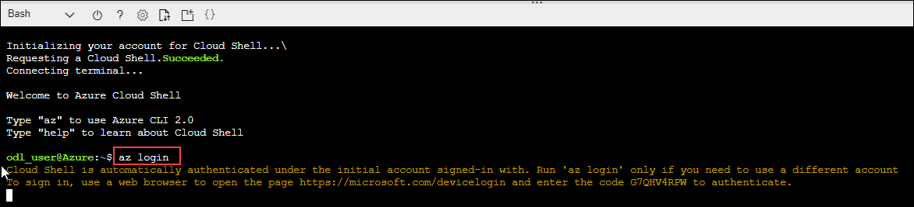
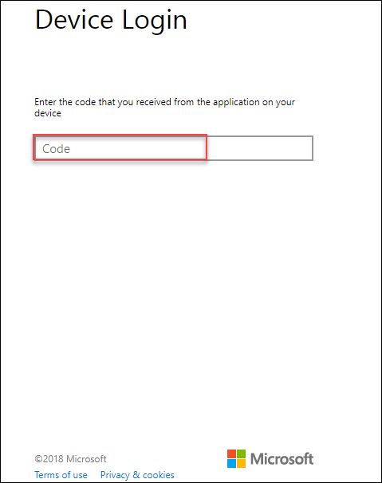
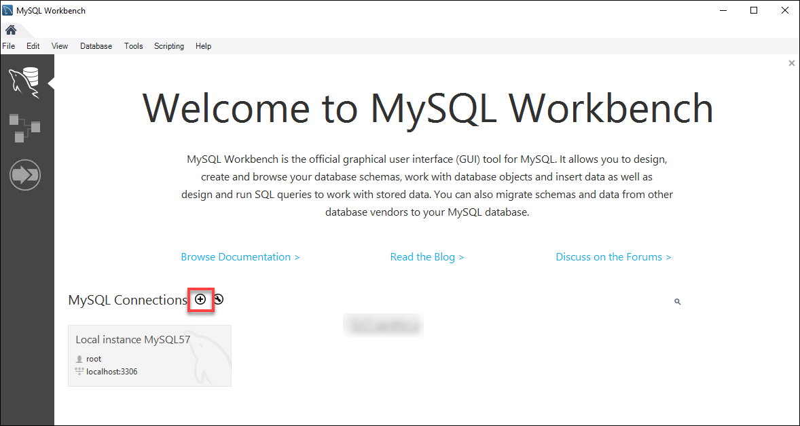
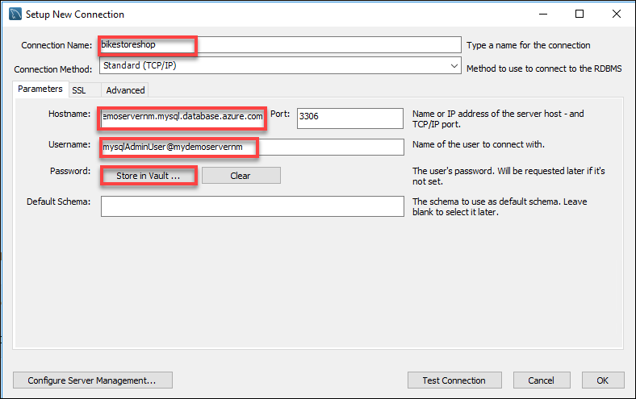
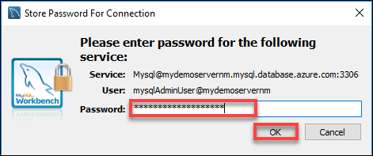
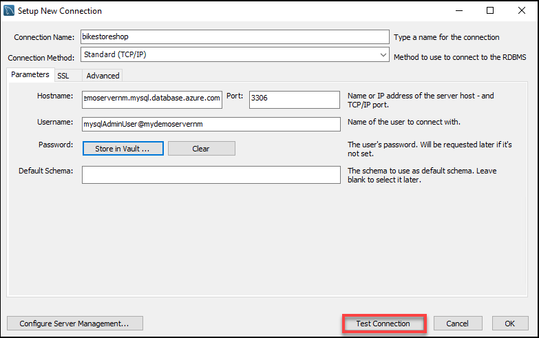
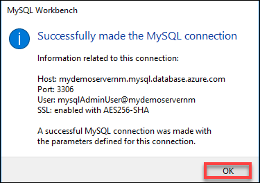
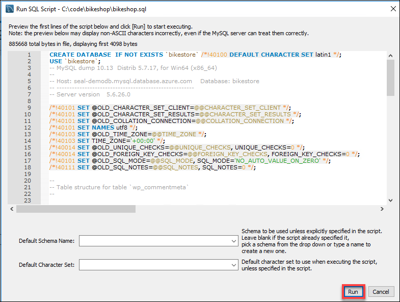
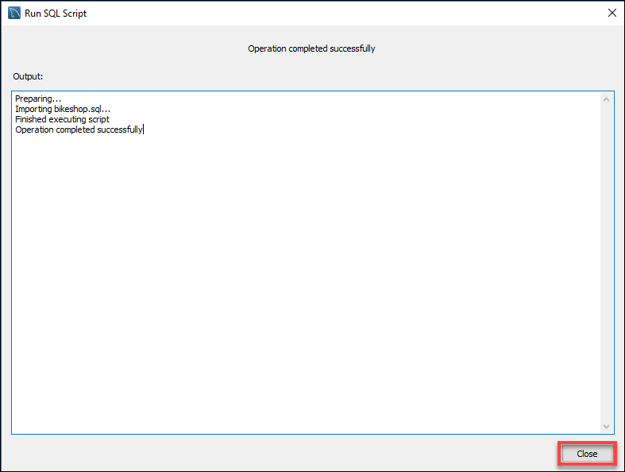

# Azure Database for MySQL

Azure Database for MySQL provides a fully managed database service for application development and deployment allowing you to provision a MySQL database instance in minutes and scale it on the fly. With comprehensive pricing models, and configurable sizing, you get all the features you need such as high-availability, monitoring and security, and backup and recovery, all with reduced management overhead. These features are built into the service and are aligned to a simple, predictable pricing model.

## Provision MySQL Server

### Create a database using Azure CLI
Launch cloudshell from top right corner.


1. Run the az login command.

```
az login
```

2.	When prompted, open a web browser window and open <copy>https://aka.ms/devicelogin </copy> and enter the code shown in the console window.


3.	Sign in with your Azure Credentials that provided for this lab.
4.	You now have an Azure CLI session open against the Azure Subscription hosting your lab.
5.	You will now use the CLI to provision an Azure Database for MySQL. In the open PowerShell prompt, use the following command to provision an new Azure Database for MySQL:
```
az mysql server create --resource-group <resource-group-name> --sku-name GP_Gen5_8 --name <server name> --location <location> --admin-user mysqlAdminUser --admin-password mysqlAdminPassw0rd! --ssl-enforcement Disabled --storage-size 51200
```

6.	By default the database is completely locked down and cannot be accessed, so we need to add a firewall rule to allow us to connect to the database server. The rule we're creating here allows all traffic, in production scenarios the rule would be much more restricted.
```
az mysql server firewall-rule create --resource-group <resource-group-name> --server <server name> --name AllowAllIps --start-ip-address 0.0.0.0 --end-ip-address 255.255.255.255
```

## Deploy the website

We now need to change some configuration code for the WordPress website so that it is able to consume data from the database which we have just provisioned. Once we have updated the code we'll deploy it to an Azure App Service which has already been provisioned.

1.	First we need to Login in VM and acquire a copy of the code for the website. For this we will clone it from an existing GitHub repository. In the open PowerShell command prompt run the following commands:
```
cd \
mkdir code 
cd code
git clone https://github.com/gavinbarron/bikeshop.git 
```
2.	Next we need to set some git configuration values so that we can push any changes which are made to remote repositories. To do this run the following commands in the command prompt:
```
cd bikeshop
git config user.name  "holuser"
git config user.email "<AzureAdUserEmail>"
```
3.	Now we need to update the code to use the MySQL databse which was previously provisioned. To do this, Open **Visual Studio Code**.
4.	Using the file menu choose Open File.
5.	Open the wp-config.php file at **C:\code\bikeshop\**
6.	On line 44 replace [Username] with **mysqlAdminUser@mysql**
7.	On line 47 replace [Password] with **mysqlAdminPassw0rd!**
8.	On line 51 replace [Servername] with **yourservername**
9.	**Save** the changes.
10.	To deploy this code to the website that has been provisioned you will need to set up some deployment credentials for your user account. To do this, switch back to the open PowerShell prompt.
11.	Execute this command to set your deployment username and password:
```
az webapp deployment user set --user-name "username" --password gitDeployPassw0rd!
```

12. Execute the command to create web app:
```
az webapp create --name testwebapp --resource-group ODL-dms-35892-onpremisesrg --plan newappPlan --deployment-local-git
```
12.	Now we need to configure the local git repository to know about the website. To do this we will add a new remote to the repository:
```
git remote add website "https://username@webappname.scm.azurewebsites.net/uniquename.git"
```
13.	Commit your changes to the local git repository:
```
git add . 
git commit -m "Updating config to point at new Azure Database for MySQL"
```
14.	Deploy your changes to the **Azure App Service**:
``` 
git push website
```
15.	In the pop-up enter the deployment credentials password, **<copy>gitDeployPassw0rd!</copy>**, that you set previously and click OK. 
16.	Wait for the push to the website to complete.
17.	The website is now updated and just needs data.

### Populate Data

Before our WordPress website will work we need to populate the database with data. To do this, we are going to use The MySQL Workbench to connect to our Azure Database for MySQL that we already have up and running and use a script to restore data into the database.

1.	Open **MySQL Workbench** in your labvm.

2.	Click **OK** and ignore the unsupported operating system warning.
3.	Click on the **+** icon to add a new **MySQL Connection**.

4.	Setup the new connection to MySQL using the server name, username, and password.
* Connection Name: **<copy>bikestoreshop</copy>**
* Hostname: **<copy>mysql<inject key="myResourceGroupName" story-id="story://content-private/content/dfd/SP-OSS/azure-mysql/wordpress-and-mysql/story_a_deploy" copy="false" />.mysql.database.azure.com</copy>**
* Username: **<copy>mysqlAdminUser@mysql<inject key="myResourceGroupName" story-id="story://content-private/content/dfd/SP-OSS/azure-mysql/wordpress-and-mysql/story_a_deploy" copy="false" /></copy>**


5.	Click on **"Store in Vault..."** to enter password, then click **OK**.


6.	Click on **Test Connection** to verify that you have configured the connection correctly.


7. If you have issues check that you have provided the all of the details correctly. Once the test connection action succeeds click on **OK**.


8.	Double click on the connection name to open a session against your MySQL database.
9.	Choose File > Run SQL Script. 
10.	Open the sql file from **C:\code\bikeshop\bikeshop.sql** and click the **Run**.

11.	Once the script has been executed the database schema "bikestore" will have been created, click the **Close** button.

12.	Click the refresh icon to see it listed in the set of availble schema.
13.	Open the web site: <inject key="webSiteUrl" story-id="story://content-private/content/dfd/SP-OSS/azure-mysql/wordpress-and-mysql/story_a_deploy" />
14.	The website should be up and running.

## Scale Up Azure Database for MySQL

Microsoft Azure offers a variety of pricing tiers for the Azure Database for MySQL service. In the earlier stages of this hands on lab, the lowest priced teir was used. In the real world, there may be times the application which relies upon your MySQL database will come under heavy load. In turn, this load may consume all of the resources available to your MySQL database instance, causing degraded performance. Scaling up your Azure Database for MySQL will help to noticeably improve performance in many of these cases, allowing you to keep processing your data efficiently.
Refer to these documentation articles for more infomation on Pricing Tiers should you want to get more information on scaling your MySQL databases.
There are two options to scale up or scale down the Azure Database for MySQL service, either using the portal or via CLI.

### Using the Azure Portal
1.	Open the Azure portal in a web browser <copy>https://portal.azure.com </copy>.
2.	Open All Resources blade.
3.	Click on the MySQL database mysql<inject key="myResourceGroupName" story-id="story://content-private/content/dfd/SP-OSS/azure-mysql/wordpress-and-mysql/story_a_deploy" copy="false" />.
4.	Click Pricing Tier option.
5.	Change the vCore and Storage up or down as need and click OK to save changes.

   >Note that the Basic level can only scale to 2 vCores and 1024 GB of storage

### Using the Azure CLI 2.0
1.	Using the PowerShell prompt that you have open and connected to the Azure subscription.
2.	Using Azure CLI get information about the MySQL databases that you have access to:
```
az mysql server list
```
3.	The cli will provide a list of your MySQL databases, there should only be one. Note the resourceGroup and name values 
4.	On the command prompt, run below command to scale up to 2 vCore and 70 GB of Storage
```
az mysql server update --resource-group <inject key="myResourceGroupName" story-id="story://content-private/content/dfd/SP-OSS/azure-mysql/wordpress-and-mysql/story_a_deploy" copy="false" /> --name mysql<inject key="myResourceGroupName" story-id="story://content-private/content/dfd/SP-OSS/azure-mysql/wordpress-and-mysql/story_a_deploy" copy="false" /> --compute-units 100 --set storageMb=71680
```
5.	Run below command to scale down to 1 vCore.

   >Note that storage cannot be scaled down
   
```
az mysql server update --resource-group <inject key="myResourceGroupName" story-id="story://content-private/content/dfd/SP-OSS/azure-mysql/wordpress-and-mysql/story_a_deploy" copy="false" /> --name mysql<inject key="myResourceGroupName" story-id="story://content-private/content/dfd/SP-OSS/azure-mysql/wordpress-and-mysql/story_a_deploy" copy="false" /> --compute-units 50
```

### CONCLUSION
As a fully integrated service, Azure Database for MySQL plugs you into Microsoft’s global network of value-add services, datacenters, security features, and round-the-clock monitoring. Azure Database for MySQL is designed to deliver highly available MySQL Compatibility at scale to the forefront, all backed by a best of class SLA. Trust Azure to keep your enterprise-ready MySQL applications up and running.
