# Module 2: Migrate MySQL to Azure Database for MySQL online using DMS

You can use the Azure Database Migration Service to migrate the databases from an on-premises MySQL instance to Azure Database for MySQL with minimal downtime. In other words, migration can be achieved with minimum downtime to the application. In this tutorial, you migrate the Employees sample database from an on-premises instance of MySQL 5.7 to Azure Database for MySQL by using an online migration activity in the Azure Database Migration Service.

Throughout this lab, we will use the **Azure Command Line Interface** or **Azure CLI** using the **Cloud Shell** feature in the **Azure Portal**.

## Scenario Overview
1.1: **Create an Azure storage account and initialize Azure Cloud Shell for Azure CLI.
1.2: **Create an Azure Database for MySQL server 
1.3: **Migrate the sample schema using mysqldump utility.
1.4: **Create an instance of the Azure Database Migration Service.
1.5: **Create a migration project by using the Azure Database Migration Service.
1.6: **Run the migration.
1.7: **Monitor the migration.

## 1.1: Create an Azure storage account and initialize Azure Cloud Shell for Azure CLI.
1.  **Navigate** to https://portal.azure.com and login from the provided credentials.
2.  **Enter** the **Username** which was displayed in the previous window and **click** on **Next**.<br/>
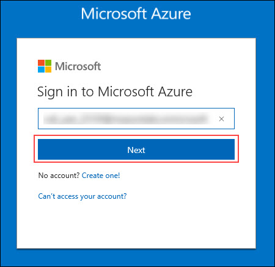<br/>
3.	In the Stay signed in? pop-up window, click **No**. **Enter** the **Password** and click on **Sign in**.<br/>
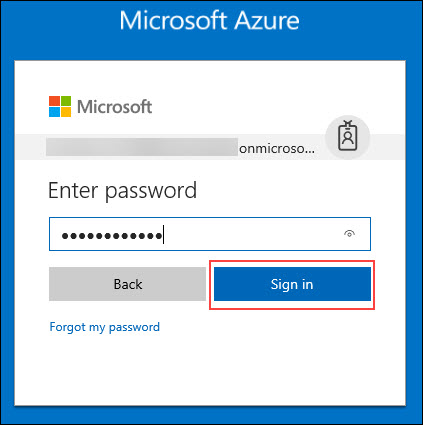<br/>
4.	In the Welcome to **Microsoft Azure** pop-up window, click **Maybe Late**r. Initialize the **Azure CLI**.
5.	To launch the **Azure Cloud Shell**, click the **Cloud Shell** button on the menu in the top menu bar of the Azure portal. The button launches an interactive shell that you can use to run all of the steps required to create and manage an Ubuntu Linux VM.<br/>
<br/>
6.	Once the shell launches, you will see **Welcome to Azure Cloud Shell**. Click on the **Bash (Linux)** option at the bottom.<br/>
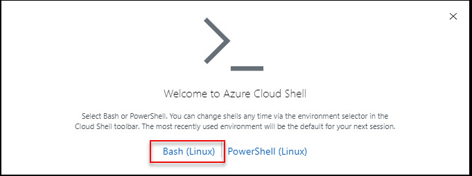<br/>
7.	In the **You have no storage mounted** tab, click on **Show Advanced Settings**.<br/>
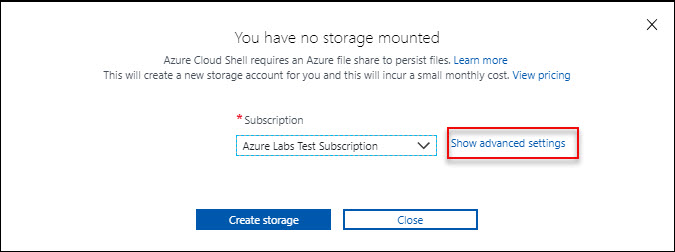<br/>
8.	In the **Advanced Settings** tab, use the existing **Resource Group** and enter a unique name for the **Storage Account** and **File Share**.<br/>
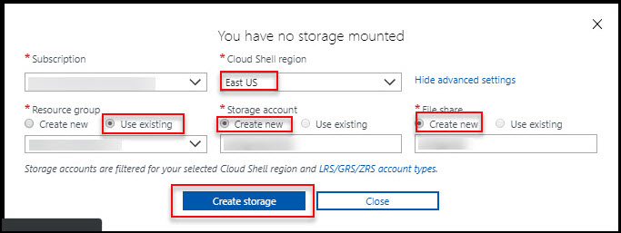<br/>
9.	Click **Create Storage**.
10. Once the storage gets created, your **Cloud Shell** will initialize and very shortly be ready to use.<br/>
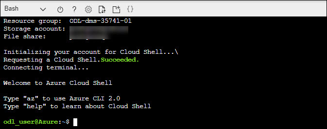<br/>

   > Note: the Resource Group name, the Storage Account, and the File Share you created are displayed in the CLI while it initializes.
You may enlarge the shell by dragging the border or clicking on the maximize button on ht etop right of the shell.

## 1.2: Create an Azure Database for MySQL server
Launch Azure Cloud Shell on the upper right of the Azure portal.


2.	You will now use the CLI to provision an Azure Database for MySQL. In the open PowerShell prompt, use the following command to provision an new Azure Database for MySQL: 
Please note that you need to provide existing resource groups, which is pre-created for you.You have two pre-created resource groups:ODL_dms_XXXX-cloudrg and ODL_dms_XXXX-Onpremisesrg.It should be create in ODL_dms_XXXX-cloudrg. Server name will have to be a unique name across azure MySQL databases. Choose location as the same location where your resource group is located. 
* --resource-group : Give your **ODL_dms_XXXX-cloudrg** Resourse Group name
* --sku-name: **GP_Gen5_8** 
* --name : Give any unique name for your **MySQL server**
* --location: **as per your existing resource group**
* --admin-user: **mysqlAdminUser**
* --admin-password: any password for your server
* --ssl-enforcement: Disabled
* --storage-size: **51200**
Then copy and paste in **Azure Cloud Shell** command line. 

```
az mysql server create --resource-group <resource-group-name> --sku-name GP_Gen5_8 --name <server name> --location <location> --admin-user mysqlAdminUser --admin-password mysqlAdminPassw0rd! --ssl-enforcement Disabled --storage-size 51200
```
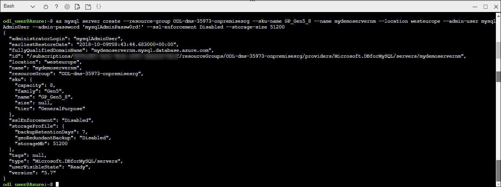

3.	By default the database is completely locked down and cannot be accessed, so we need to add a firewall rule to allow us to connect to the database server. The rule we're creating here allows all traffic, in production scenarios the rule would be much more restricted.
Please ensure to change RG Name and Server Name.
* --resource-group : Give your **ODL_dms_XXXX-cloudrg** Resourse Group name
* --server : Give name of your **MySQL server**.
```
az mysql server firewall-rule create --resource-group <resource-group-name> --server <server name> --name AllowAllIps --start-ip-address 0.0.0.0 --end-ip-address 255.255.255.255
```
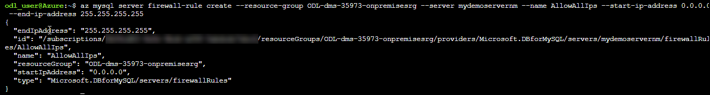

## Create an Azure Database for MySQL server

To connect to your database server, you need the full server name and admin sign-in credentials.If you didn't, you can easily find the server name and sign-in information from the server Overview page or the Properties page in the Azure portal.
To find these values, take the following steps:
1.	Open your server's Overview page. Make a note of the Server name and Server admin login name.
2.	Hover your cursor over each field, and the copy icon appears to the right of the text. Select the copy icon as needed to copy the values.

For example, the server name is mydemoserver.mysql.database.azure.com, and the server admin sign-in is myadmin@mydemoserver.

### Connect to MySQL by using Cloud Shell

1. Launch Azure Cloud Shell via the terminal icon **(>_)** on the upper right of the Azure portal.


2. Azure Cloud Shell opens in your browser, where you can type bash shell commands.
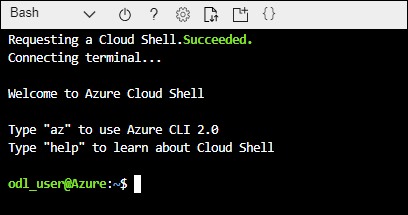

3. At the Cloud Shell prompt, connect to your Azure Database for MySQL server by typing the mysql command line.To connect to an Azure Database for MySQL server with the mysql utility, use the following format:
```
mysql --host <fully qualified server name> --user <server admin login name>@<server name> -p
```
After it's connected, the mysql utility displays a mysql> prompt at which you can type commands.
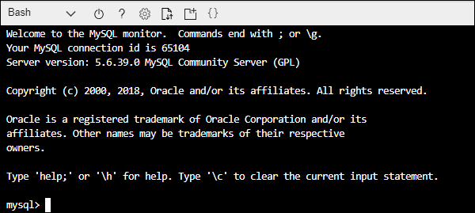

4. To ensure the connection is functional, view the server status by typing status at the mysql> prompt.
```
status
```
5. Create a blank database at the mysql> prompt by typing the following command:
```
CREATE DATABASE sakila;
```
The command might take a few moments to complete.

6. List the databases at the mysql> prompt by typing the following command:
```
SHOW DATABASES;
```
7. Type **\q**, and then select the Enter key to quit the mysql tool. You can close Azure Cloud Shell after you are done.

## Migrate the sample schema

To complete all the database objects like table schemas, indexes and stored procedures, we need to extract schema from the source database and apply to the database.<br/>

1. Login to **dms-dev-vm** and download **Remote Desktop Connection** file.<br/>
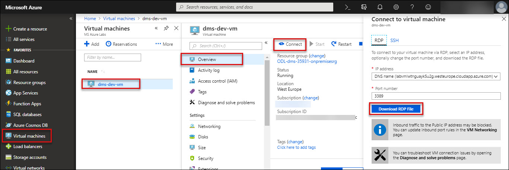<br/>

2. Inside the virtual machine launch MySQL workbench, If you have foreign keys in your schema, the initial load and continuous sync of the migration will fail. Execute the following script in MySQL workbench to extract the drop foreign key script and add foreign key script.
```
SET group_concat_max_len = 8192;
    SELECT SchemaName, GROUP_CONCAT(DropQuery SEPARATOR ';\n') as DropQuery, GROUP_CONCAT(AddQuery SEPARATOR ';\n') as AddQuery
    FROM
    (SELECT 
    KCU.REFERENCED_TABLE_SCHEMA as SchemaName,    
    KCU.TABLE_NAME,
    KCU.COLUMN_NAME,
    CONCAT('ALTER TABLE ', KCU.TABLE_NAME, ' DROP FOREIGN KEY ', KCU.CONSTRAINT_NAME) AS DropQuery,
    CONCAT('ALTER TABLE ', KCU.TABLE_NAME, ' ADD CONSTRAINT ', KCU.CONSTRAINT_NAME, ' FOREIGN KEY (`', KCU.COLUMN_NAME, '`) REFERENCES `', KCU.REFERENCED_TABLE_NAME, '` (`', KCU.REFERENCED_COLUMN_NAME, '`) ON UPDATE ',RC.UPDATE_RULE, ' ON DELETE ',RC.DELETE_RULE) AS AddQuery
    FROM INFORMATION_SCHEMA.KEY_COLUMN_USAGE KCU, information_schema.REFERENTIAL_CONSTRAINTS RC
    WHERE
      KCU.CONSTRAINT_NAME = RC.CONSTRAINT_NAME
      AND KCU.REFERENCED_TABLE_SCHEMA = RC.UNIQUE_CONSTRAINT_SCHEMA
  AND KCU.REFERENCED_TABLE_SCHEMA = 'SchemaName') Queries
  GROUP BY SchemaName;
```  
3. Run the drop foreign key (which is the second column) in the query result to drop foreign key.we need to run the one more query to drop the foreign key.
```
SELECT concat('ALTER TABLE ', TABLE_NAME, ' DROP FOREIGN KEY ', CONSTRAINT_NAME, ';') 
FROM information_schema.key_column_usage 
WHERE CONSTRAINT_SCHEMA = 'employees' 
AND referenced_table_name IS NOT NULL;
```
4. Inside the virtual machine click on **Start** button search for **command prompt**, run it as **administrator**.</br> 
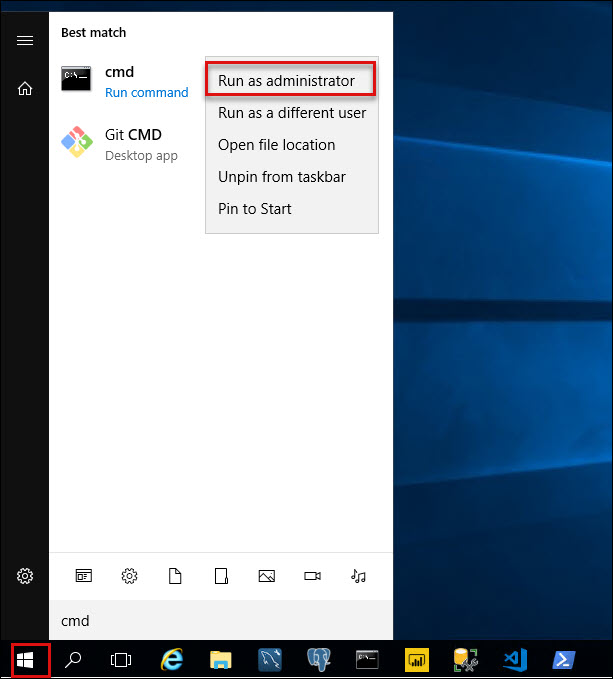<br/>
5. Change the directory to **C:\CloudLabs\Installer\test_db-master\test_db-master\sakila** using following command:
```
cd C:\CloudLabs\Installer\test_db-master\test_db-master\sakila
```  
6. You have MySQL sakila sample database in the on-premise system, Use **mysqldump**  command to do schema migration.
```
mysqldump -h [servername] -u [username] -p[password] --databases [db name] --no-data > [schema file path]
```
7. To import schema to Azure Database for MySQL target, run the following command:
```
mysql.exe -h [servername] -u [username] -p[password] [database]< [schema file path]
```

## Create a migration project
Please note that you have already dms instance,which is pre-created for you. It would be in existing rg ODL_dms_XXXX-cloudrg.
1.	In the Azure portal, select All services, search for Azure Database Migration Service, and then select Azure Database Migration Services.Select + **New Migration Project**.<br/>
 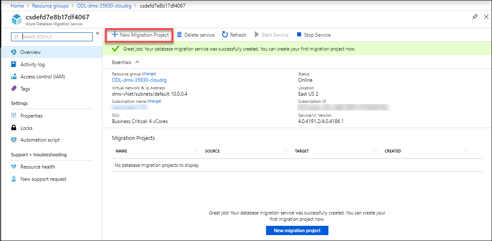<br/>
2.	On the New migration project screen, specify a name for the project, in the Source server type text box, select MySQL, in the Target server type text box, select AzureDatabaseForMySQL.<br/>
3. In the **Choose type of activity** section, select **Online data migration**.
``` 
Note
Alternately, you can chose Create project only to create the migration project now and execute the migration later.
```
4.	Select Save, note the requirements to successfully use DMS to migrate data, and then select Create and run activity.<br/>
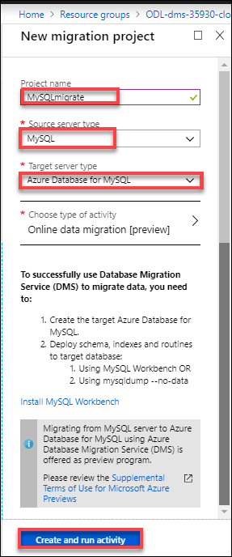

## Specify source details
1.	On the Add Source Details screen, specify the connection details for the source MySQL instance.Select Save<br/>
 <br/>
 
## Specify target details
1.On the Target details screen, specify the connection details for the target Azure Database for MySQL server, which is the pre-provisioned instance of Azure Database for MySQL to which the Employees schema was deployed by using mysqldump.<br/>
 <br/>
2.	Select Save, and then on the Map to target databases screen, map the source and the target database for migration.<br/>
If the target database contains the same database name as the source database, the Azure Database Migration Service selects the target database by default.<br/>
 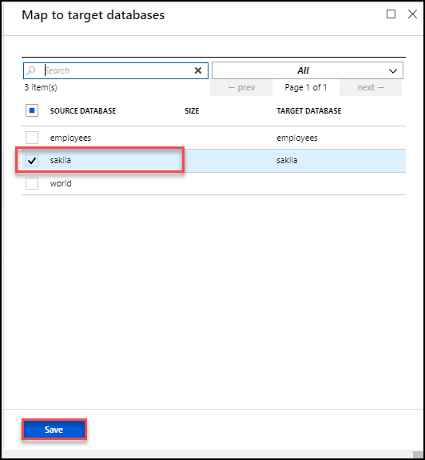<br/>
3.	Select Save, on the Migration summary screen, in the Activity name text box, specify a name for the migration activity, and then review the summary to ensure that the source and target details match what you previously specified.Select **Run migration**.<br/>
 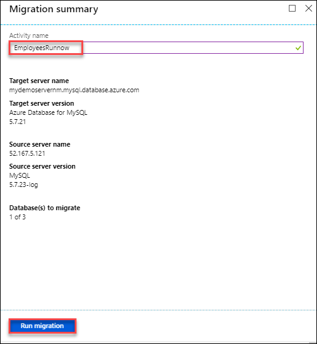<br/>

The migration activity window appears, and the Status of the activity is initializing.

## Monitor the migration
1.	On the migration activity screen, select Refresh to update the display until the Status of the migration shows as Running.<br/>
 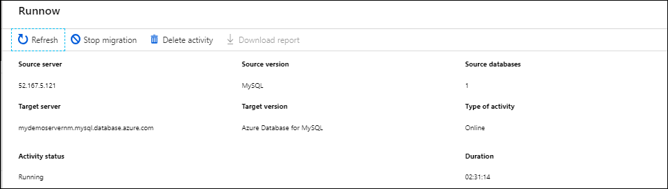<br/>
2.	Under Database Name, select specific database to get to the migration status for Full data load and Incremental data sync operations.
Full data load will show the initial load migration status while Incremental data sync will show change data capture (CDC) status.
 
## Perform migration cutover
After the initial Full load is completed, the databases are marked Ready to cutover.
1.	When you're ready to complete the database migration, select Start Cutover.
 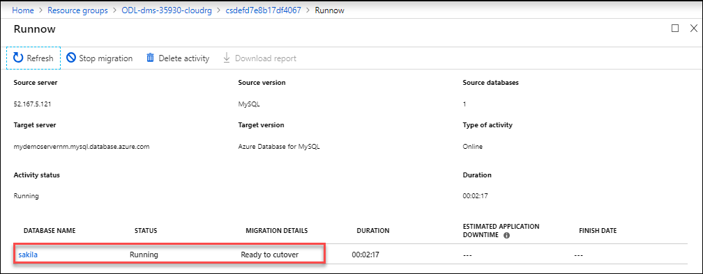<br/>
2.	Make sure to stop all the incoming transactions to the source database; wait until the Pending changes counter shows 0.
3.	Select Confirm, and the select Apply.
4.	When the database migration status shows Completed, connect your applications to the new target Azure SQL Database.
