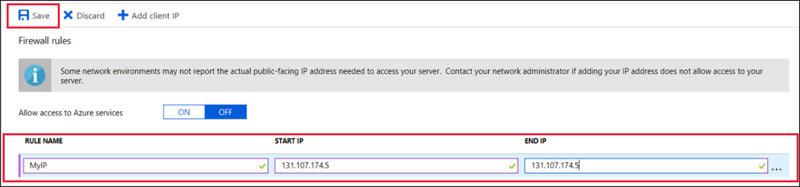
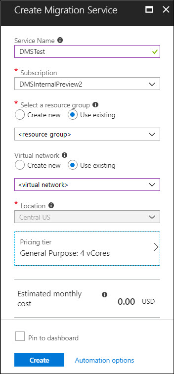
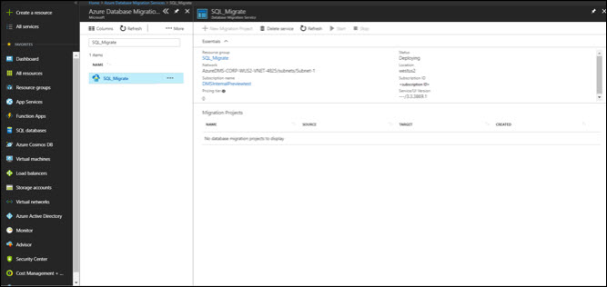
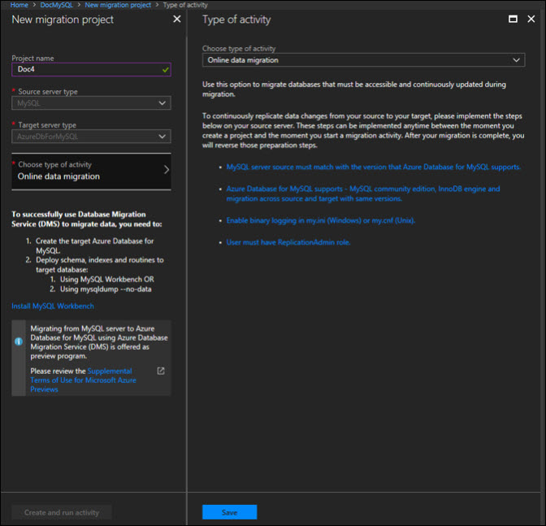
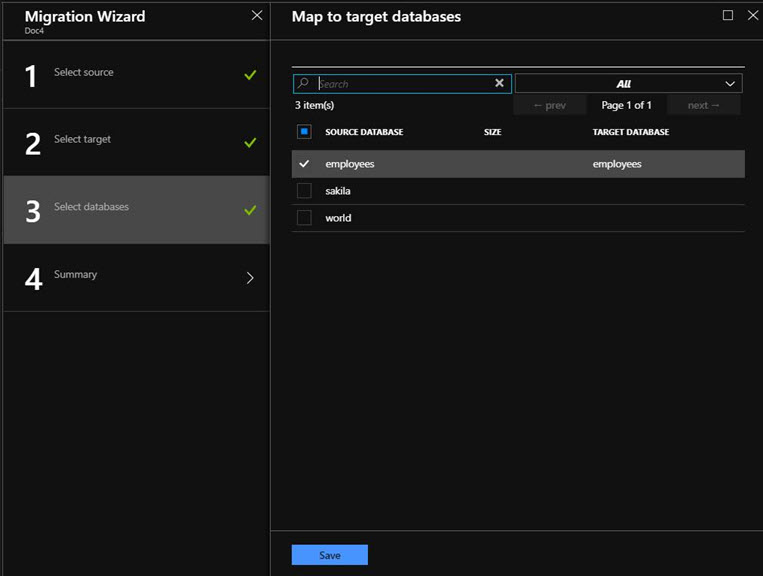
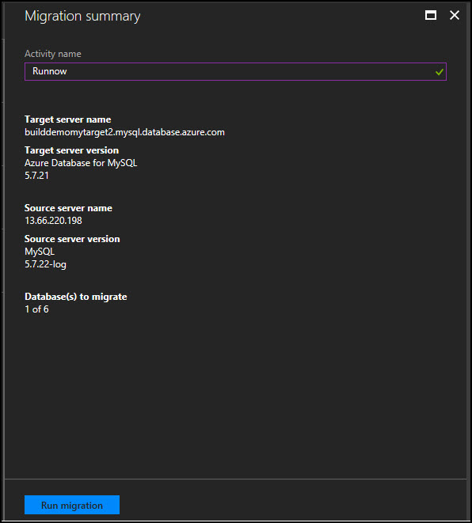

# Module 2: Migrate MySQL to Azure Database for MySQL online using DMS

You can use the Azure Database Migration Service to migrate the databases from an on-premises MySQL instance to Azure Database for MySQL with minimal downtime. In other words, migration can be achieved with minimum downtime to the application. In this tutorial, you migrate the Employees sample database from an on-premises instance of MySQL 5.7 to Azure Database for MySQL by using an online migration activity in the Azure Database Migration Service.
In this tutorial, you learn how to:
*   Create an Azure Database for MySQL server 
*	Migrate the sample schema using mysqldump utility.
*	Create an instance of the Azure Database Migration Service.
*	Create a migration project by using the Azure Database Migration Service.
*	Run the migration.
*	Monitor the migration.

## Create an Azure Database for MySQL server

You create an Azure Database for MySQL server with a defined set of compute and storage resources. You create the server within an Azure resource group.
Follow these steps to create an Azure Database for MySQL server:
1.	Select the Create a resource button (+) in the upper-left corner of the portal.
2.	Select Databases > Azure Database for MySQL. You can also type MySQL in the search box to find the service.<br/>
<br/>
3.	Fill out the new server details form with the following information:<br/>
<br/>
4.	Select Create to provision the server. Provisioning can take up to 20 minutes.
5.	Select Notifications on the toolbar (the bell icon) to monitor the deployment process.

By default, the following databases are created under your server: information_schema, mysql, performance_schema, and sys

## Configure a server-level firewall rule

The Azure Database for MySQL service creates a firewall at the server level. It prevents external applications and tools from connecting to the server and any databases on the server, unless a firewall rule is created to open the firewall for specific IP addresses.
1.	After the deployment finishes, locate your server. If necessary, you can search for it. For example, select All Resources from the menu on the left. Then type in the server name, such as the example mydemoserver, to search for your newly created server. Select the server name from the search result list. The Overviewpage for your server opens and provides options for further configuration.
2.	On the server page, select Connection security.
3.	Under the Firewall rules heading, select the blank text box in the Rule Name column to begin creating the firewall rule. Enter the precise range of IPs of the clients that will be accesing this server.<br/>
<br/>
4.	On the upper toolbar of the Connection security page, select Save. Wait until the notification appears stating that the update has finished successfully before you continue.
```
Note
Connections to Azure Database for MySQL communicate over port 3306. If you try to connect from within a corporate network, outbound traffic over port 3306 might not be allowed. If this is the case, you can't connect to your server unless your IT department opens port 3306.
```
## Get the connection information

To connect to your database server, you need the full server name and admin sign-in credentials. You might have noted those values earlier in the Quickstart article. If you didn't, you can easily find the server name and sign-in information from the server Overview page or the Properties page in the Azure portal.
To find these values, take the following steps:
1.	Open your server's Overview page. Make a note of the Server name and Server admin login name.
2.	Hover your cursor over each field, and the copy icon appears to the right of the text. Select the copy icon as needed to copy the values.

In this example, the server name is mydemoserver.mysql.database.azure.com, and the server admin sign-in is myadmin@mydemoserver.
Connect to MySQL by using the mysql command-line tool. There are a number of applications you can use to connect to your Azure Database for MySQL server.

## Connect to MySQL by using the mysql command-line tool

Let's first use the mysql command-line tool to illustrate how to connect to the server. You can also use a web browser and Azure Cloud Shell as described here without installing additional software. If you have the mysql utility installed locally, you can connect from there as well.
1.	Launch Azure Cloud Shell via the terminal icon (>_) on the upper right of the Azure portal.<br/>
<br/>
2.	Azure Cloud Shell opens in your browser, where you can type bash shell commands.<br/>
<br/>
3.	At the Cloud Shell prompt, connect to your Azure Database for MySQL server by typing the mysql command line.
To connect to an Azure Database for MySQL server with the mysql utility, use the following format:
```
mysql --host <fully qualified server name> --user <server admin login name>@<server name> -p
```
4.	To ensure the connection is functional, view the server status by typing status at the mysql> prompt.
```
status
```
5.	Create a blank database at the mysql> prompt by typing the following command:
```
CREATE DATABASE quickstartdb;
```
6.	List the databases at the mysql> prompt by typing the following command:
```
SHOW DATABASES;
```
7.	Type \q, and then select the Enter key to quit the mysql tool. You can close Azure Cloud Shell after you are done.

Now you have connected to the Azure Database for MySQL server and created a blank user database. Continue to the next section for a similar exercise. The next exercise connects to the same server by using another common tool, MySQL Workbench.

## Migrate the sample schema

To complete all the database objects like table schemas, indexes and stored procedures, we need to extract schema from the source database and apply to the database. To extract schema, you can use mysqldump with - - no-data parameter.

If you have foreign keys in your schema, the initial load and continuous sync of the migration will fail. Execute the following script in MySQL workbench to extract the drop foreign key script and add foreign key script.
```
SET group_concat_max_len = 8192;
    SELECT SchemaName, GROUP_CONCAT(DropQuery SEPARATOR ';\n') as DropQuery, GROUP_CONCAT(AddQuery SEPARATOR ';\n') as AddQuery
    FROM
    (SELECT 
    KCU.REFERENCED_TABLE_SCHEMA as SchemaName,    
    KCU.TABLE_NAME,
    KCU.COLUMN_NAME,
    CONCAT('ALTER TABLE ', KCU.TABLE_NAME, ' DROP FOREIGN KEY ', KCU.CONSTRAINT_NAME) AS DropQuery,
    CONCAT('ALTER TABLE ', KCU.TABLE_NAME, ' ADD CONSTRAINT ', KCU.CONSTRAINT_NAME, ' FOREIGN KEY (`', KCU.COLUMN_NAME, '`) REFERENCES `', KCU.REFERENCED_TABLE_NAME, '` (`', KCU.REFERENCED_COLUMN_NAME, '`) ON UPDATE ',RC.UPDATE_RULE, ' ON DELETE ',RC.DELETE_RULE) AS AddQuery
    FROM INFORMATION_SCHEMA.KEY_COLUMN_USAGE KCU, information_schema.REFERENTIAL_CONSTRAINTS RC
    WHERE
      KCU.CONSTRAINT_NAME = RC.CONSTRAINT_NAME
      AND KCU.REFERENCED_TABLE_SCHEMA = RC.UNIQUE_CONSTRAINT_SCHEMA
  AND KCU.REFERENCED_TABLE_SCHEMA = 'SchemaName') Queries
  GROUP BY SchemaName;
```  
  
Run the drop foreign key (which is the second column) in the query result to drop foreign key.

If you have trigger in the data (insert or update trigger), it will enforce data integrity in the target ahead of the replicated data from the source. The recommendation is to disable triggers in all the tables at the target during migration, and then enable the triggers after migration is done.

To disable triggers in target database, use the following command:
```
SELECT Concat('DROP TRIGGER ', Trigger_Name, ';') FROM  information_schema.TRIGGERS WHERE TRIGGER_SCHEMA = 'your_schema';
```

Assuming you have MySQL employees sample database in the on-premise system, the command to do schema migration using mysqldump is:
```
mysqldump -h [servername] -u [username] -p[password] --databases [db name] --no-data > [schema file path]
```
To import schema to Azure Database for MySQL target, run the following command:
```
mysql.exe -h [servername] -u [username] -p[password] [database]< [schema file path]
```

### Register the Microsoft.DataMigration resource provider

1.	Sign in to the Azure portal, select All services, and then select Subscriptions.<br/>
 <br/>
2.	Select the subscription in which you want to create the instance of the Azure Database Migration Service, and then select Resource providers.<br/>
 <br/>
3.	Search for migration, and then to the right of Microsoft.DataMigration, select Register.<br/>
 <br/>
 
## Create a DMS instance
1.	In the Azure portal, select + Create a resource, search for Azure Database Migration Service, and then select Azure Database Migration Service from the drop-down list.<br/>
 <br/>
2.	On the Azure Database Migration Service screen, select Create.<br/>
 <br/>
3.	On the Create Migration Service screen, specify a name for the service, the subscription, and a new or existing resource group.<br/>
4.	Select an existing virtual network (VNET) or create a new one.<br/>
The VNET provides the Azure Database Migration Service with access to the source SQL Server and the target Azure SQL Database instance.<br/>
5.	Select a pricing tier.<br/>
<br/>
6.	Select Create to create the service.

## Create a migration project
After the service is created, locate it within the Azure portal, open it, and then create a new migration project.<br/>
1.	In the Azure portal, select All services, search for Azure Database Migration Service, and then select Azure Database Migration Services.<br/>
 <br/>
2.	On the Azure Database Migration Services screen, search for the name of the Azure Database Migration Service instance that you created, and then select the instance.<br/>
 <br/>
3.	Select + **New Migration Project**.
4.	On the New migration project screen, specify a name for the project, in the Source server type text box, select MySQL, in the Target server type text box, select AzureDbForMySQL.<br/>
5.	In the **Choose type of activity** section, select **Online data migration**.<br/>
``` 
Note
Alternately, you can chose Create project only to create the migration project now and execute the migration later.
```
6.	Select Save, note the requirements to successfully use DMS to migrate data, and then select Create and run activity.<br/>

## Specify source details
1.	On the Add Source Details screen, specify the connection details for the source MySQL instance.<br/>
 <br/>
 
## Specify target details
1.	Select Save, and then on the Target details screen, specify the connection details for the target Azure Database for MySQL server, which is the pre-provisioned instance of Azure Database for MySQL to which the Employees schema was deployed by using mysqldump.<br/>
 <br/>
2.	Select Save, and then on the Map to target databases screen, map the source and the target database for migration.<br/>
If the target database contains the same database name as the source database, the Azure Database Migration Service selects the target database by default.<br/>
 <br/>
3.	Select Save, on the Migration summary screen, in the Activity name text box, specify a name for the migration activity, and then review the summary to ensure that the source and target details match what you previously specified.<br/>
 <br/>
Run the migration
*	Select Run migration.
The migration activity window appears, and the Status of the activity is initializing.

## Monitor the migration
1.	On the migration activity screen, select Refresh to update the display until the Status of the migration shows as Complete.<br/>
 <br/>
2.	Under Database Name, select specific database to get to the migration status for Full data load and Incremental data sync operations.
Full data load will show the initial load migration status while Incremental data sync will show change data capture (CDC) status.
 
## Perform migration cutover
After the initial Full load is completed, the databases are marked Ready to cutover.
1.	When you're ready to complete the database migration, select Start Cutover.
 <br/>
2.	Make sure to stop all the incoming transactions to the source database; wait until the Pending changes counter shows 0.
3.	Select Confirm, and the select Apply.
4.	When the database migration status shows Completed, connect your applications to the new target Azure SQL Database.
